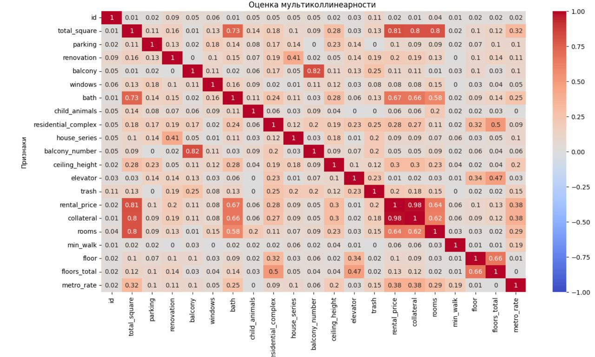

# Исследование объявлений об аренде квартир

# Релиз 3.0

1. README.md с выводами и иллюстрациями - ДОБАВЛЕН;
2. data.csv - полностью отвечающий предыдущим и новым критериям - ДОБАВЛЕН;
3. preprocessing.ipynb - ОБНОВЛЕН И ДОБАВЛЕН;
4. metro_rate.csv - Сторонняя таблица для создания новых признаков - ДЛЮАВЛЕН;

# Вывод о проделанной работке: 

1. Датафрейм data.csv проанализирован, очищен от задублированных строк, пропущенных значений, исключены выбросы ("невозможные" параметры);
2. Представлены файлы с полным описанием рабочего процесса;
3. Добавлены следующие новые признаки: этаж объекта, этажность дома объекта, пешая доступность до метро, общая площадь объекта, количество балконов, залоговая стоимость;
4. Проведена оценка мульти-коллинеарности признаков в датафрейме. Высокая корреляция обнаружена между парами признаков:
	а) стоимость аренды/стоимость залога/количество комнат; 
	б) наличие балконов/количество балконов;
5. Проведено масштабирование всех данных, за исключением колонки “id”.

**Состав команды "Matplotlib":**
Анастасия,
Роман,
Татьяна

